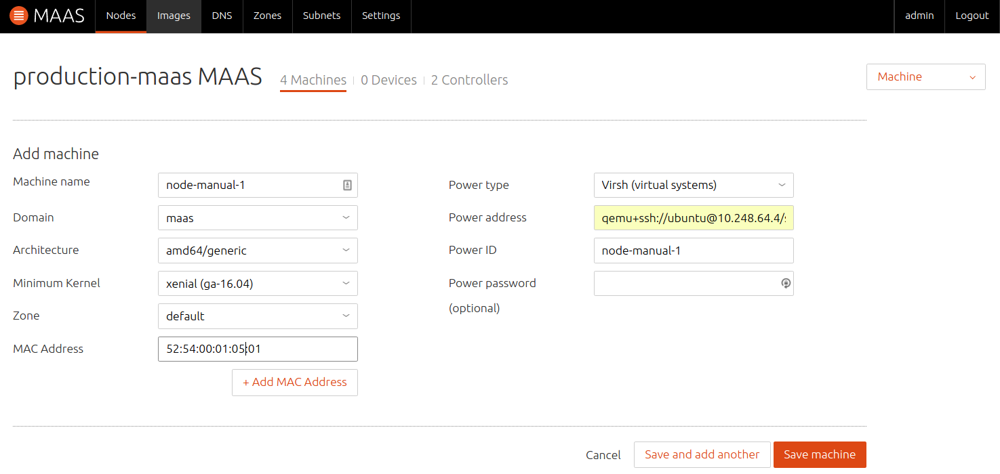

Title: Add Nodes | MAAS
TODO: Need instructions on adding a chassis
      See if 2.0 branch is using file virsh-config.png , delete if not
table_of_contents: True


# Add Nodes

Adding a node to MAAS is typically done via a combination of DHCP (and TFTP),
which should, by now, be enabled in your MAAS environment, and PXE, which you
tell the system in question to use when it boots. This unattended manner of
adding a node is called *enlistment*.

!!! Note: Configuring a computer to boot over PXE is done via its BIOS and is
often referred to as "netboot" or "network boot".

Regardless of how a node is added, there are no special requirements for the
underlying machine. In particular, there is no need to install an operating
system on it.

Once MAAS is working to the point of adding nodes it is important to
understand [node statuses](intro-concepts.md#node-statuses) and
[node actions](intro-concepts.md#node-actions).

Typically, the next step will be to *commission* the node. See
[Commission nodes](installconfig-commission-nodes.md).


## Enlistment

As explained, to enlist, the underlying machine needs to be configured to
netboot. Such a machine will undergo the following process:

1. DHCP server is contacted
1. kernel and initrd are received over TFTP
1. machine boots
1. initrd mounts a Squashfs image ephemerally over iSCSI
1. cloud-init runs enlistment scripts
1. machine shuts down

The enlistment scripts will send the region API server information about the
machine, including the architecture, MAC address and other details which will
be stored in the database. This information-gathering process is known as
*automatic discovery*.

Since any system booting off the network can enlist, the enlistment and
commission steps are separate. This allows an administrator to "accept" an
enlisted machine into MAAS.

As an alternative to enlistment, an administrator can
[add a node manually](#add-a-node-manually) (below). Typically this is done
when enlistment doesn't work for some reason.


## KVM guest nodes

KVM-backed nodes are common and so a little extra guidance is provided here.
The following actions are performed on the rack controller.

Begin by ensuring the `virsh` binary is available to the rack controller by
installing the `libvirt-bin` package:

```bash
sudo apt install libvirt-bin
```

Next, the 'maas' user will need an SSH keypair (with a null passphrase) so the
rack controller can query and manage KVM guests remotely. A login shell will
also be necessary when becoming user 'maas':

```bash
sudo chsh -s /bin/bash maas
sudo su - maas
ssh-keygen -f ~/.ssh/id_rsa -N ''
```

Add the public key to file `/home/$USER/.ssh/authorized_keys` on the KVM host:

```bash
ssh-copy-id -i ~/.ssh/id_rsa $USER@$KVM_HOST
```

Where $KVM_HOST represents the IP address of the KVM host and $USER represents
a user (typically an admin with sudo access) on the KVM host.

!!! Note: You may need to (temporarily) configure sshd on the KVM host to
honour password authentication for the `ssh-copy-id` command to succeed.

Still as user 'maas', test connecting to the KVM host with virsh:

```bash
virsh -c qemu+ssh://$USER@$KVM_HOST/system list --all
```

This should work seamlessly because the private key is passphraseless.

Exit from the user 'maas' shell:

```bash
exit
```

See
[KVM/virsh power type example](installconfig-power-types.md#example:-virsh-(kvm)-power-type).


## Add a node manually

Enlistment can be done manually if the hardware specifications of the
underlying machine are known. On the 'Nodes' page click the 'Add hardware'
button and then select 'Machine'.

Fill in the form and hit 'Save machine'. In this example, a KVM-backed node is
being added:


