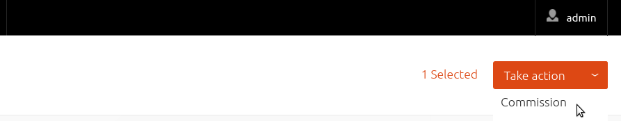
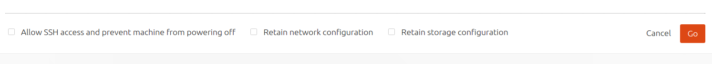
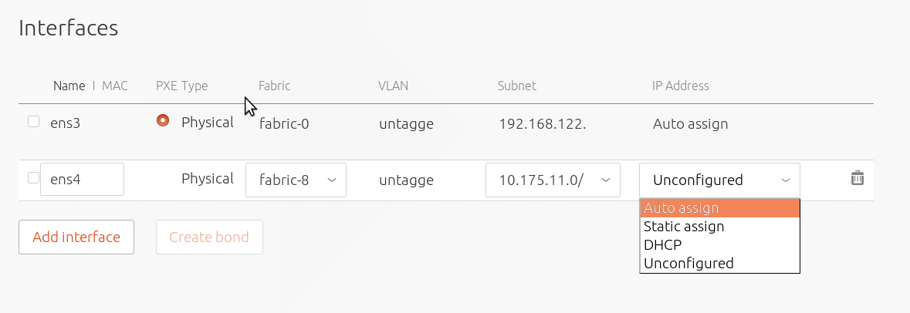

Title: Commission Nodes
TODO:  Add CLI for IP address assignment methods
       Add CLI for image/kernel to use for commissioning (?)
       Explain web UI checkboxes: 'Allow SSH access', 'Retain network configuration' and 'Retain storage configuration'

# Commission Nodes

Once a node is added to MAAS the next logical step is to *commission* it.

It does this by putting a minimal Ubuntu install onto the node and using scripts
to talk to the region API server. The purpose of this is to ensure that
everything is in working order and that eventual deployment will actually work.

The image used is, by default, the latest Ubuntu LTS release and should not
require changing. However, it can be configured in the web UI in the 'Settings'
page.

To commission a node, select it and choose 'Commission' under the 'Take action'
dropdown menu (orange button).

You have the option of selecting some extra parameters (checkboxes). Then
finalize the directive by hitting 'Go'.

While a node is commissioning its status will change to *Commissioning*. 

See [MAAS CLI](manage-cli-common.md#commission-all-machines) for how to
commission all machines with the 'New' status.

!!! Note: If your node has more than one network interface you may need to tell
MAAS which one to use. Do this by marking it *Broken* (see next section).

Once a node is commissioned its status will change to *Ready*. Consider taking
the time to [tag your nodes](installconfig-tags.md).

The next step will be to *deploy* it (see
[Deploy nodes](installconfig-deploy-nodes.md)).

## Post-commission configuration

Once a node has been commissioned, its network interface(s) can be configured.
Specifically, when a node's status is either 'Ready' or 'Broken', interfaces
can be added/removed, attached to a fabric and linked to a subnet, and provided
an IP assigment mode. 

There are four modes to choose from that determine how an address on the subnet
gets assigned when the node is eventually deployed:

- **Auto assign** MAAS will assign a random static address 
  (`iface eth0 inet static`) from among the addresses that do not fall within a
  *reserved range*.

- **Static assign** The administrator will specify a static address using a
  secondary field.

- **DHCP** A dynamic address will be leased via either MAAS-managed DHCP or an
  external DHCP server. For the former case, a *reserved dynamic range* is a
  requirement.

- **Unconfigured** The interface will be left unconfigured.

!!! Warning: If `Auto assign` is used within the context of an external DHCP
server, ensure you have defined the external DHCP IP range as a *reserved
range* to avoid IP address conflicts on the network.

See [Concepts and terms](intro-concepts.md#ip-ranges) for the definitions of
reserved range types used in MAAS.
