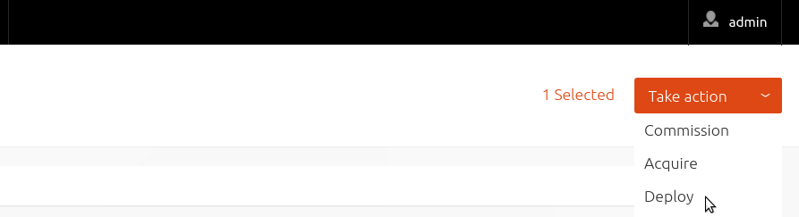
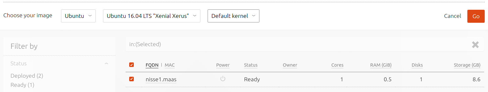

Title: Deploy Nodes | MAAS
TODO:  Add CLI for deploying (?)
       Link to curtin resources for users wishing to customize the install

# Deploy Nodes

Once a node has been [commissioned](installconfig-commission-nodes.md) the
next logical step is to *deploy* it.

Deploying a node means, effectively, to install an operating system on it. The
deployed node will also be ready to accept connections via SSH to the default
user account 'ubuntu' if
[SSH keys have been imported](manage-account.md#ssh-keys) to MAAS.

To deploy, the underlying machine needs to be configured to netboot (this
should already have been done during the commissioning stage). Such a machine
will undergo the following process:

1. DHCP server is contacted
1. kernel and initrd are received over TFTP
1. machine boots
1. initrd mounts a Squashfs image ephemerally over iSCSI
1. cloud-init triggers deployment process
    1. curtin installation script is run
    1. Squashfs image (same as above) is placed on disk

!!! Note: The *curtin* installer uses an image-based method and is now the only
installer used by MAAS. The older *debian-installer* (preseed) method has been
removed. Some remnants of preseed may still be found however. See
`/etc/maas/preseed` directory.

The agent that triggers deployment varies depending on how the nodes are
intended to be used in the long term. For instance, if the nodes are destined
to be running complex, inter-related services that may involve scaling up or
down, that is, if they will be regarded as a "cloud" resource, then
[Juju](https://jujucharms.com/docs/devel/getting-started) is the recommended
deploy agent (it will also install & configure services on the deployed nodes).
If you simply want to use MAAS to install a base operating system and work on
the machines manually then you can deploy a node directly with the web UI.

Before deploying you should:

- review and possibly set the [kernel boot options](installconfig-kernel.md)
  and [HWE kernels](installconfig-hwe-kernels.md) that may get used by deployed
  nodes.
- ensure any pertinent [SSH keys are imported](manage-account.md#ssh-keys) to
  MAAS so connections can be made to the deployed node.

To deploy directly from MAAS simply select any given node and press the
'Deploy' button.

You then have the option of deviating from the default OS, release, and kernel.
When ready, press 'Go'.

While a node is deploying its status will change to *Deploying*.

Once a node has finished deploying its status will change to *Deployed*. The
node now has an operating system installed and will accept SSH public key
authentication requests to the 'ubuntu' account.
