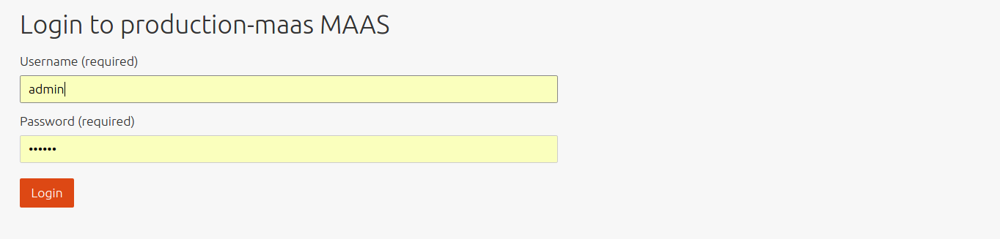

Title: Web UI | MAAS
TODO:  Link to page Device discovery when it is ready
       Link to Checklist that will explain the configuration journey when it is ready
 

# Web UI

The MAAS web UI is where users will spend much of their time. It is the
preferred way to manage MAAS. This page will explain how to access the web UI
for the first time and also draw attention to the first iteration of the MAAS
*Dashboard*.


## Access the web UI

Unless MAAS was installed from the
[Ubuntu Server ISO](installconfig-server-iso.md), you'll need to create a
user in order to access the web UI. This initial user is a MAAS administrator:

```bash
sudo maas createadmin --username=$PROFILE --email=$EMAIL_ADDRESS
```

For example:

```bash
sudo maas createadmin --username=admin --email=admin@example.com
```

The username can be anything. You will also be prompted to supply a password
for the user. There is a command option ('--password=$PASSWORD') that can be
used to specify one but depending on your environment this may pose a security
risk.

!!! Note: At this time MAAS does not make use of the email address. However, it
may do so in the future.

You can now log in here: <http://<region controller address\>:5240/MAAS>



The initial administrator will be shown the MAAS Dashboard after they log in
for the first time. Here, they are prompted to answer a few questions in
order to get MAAS up and running quickly.

Once logged in, an administrator can create regular users as well as additional
administrators. See [User Accounts](manage-account.md) for this.

See [MAAS CLI](manage-cli.md) for logging in via the CLI and working with
the CLI.


## MAAS Dashboard

The Dashboard will be a central hub for the user to branch out to other parts
of the web UI to perform certain operations. For now, it points to the main
pages of the web UI such as Nodes, Images, and Subnets. It is also where the
results of Device discovery are recorded.

The Dashboard is available by clicking the top-left MAAS icon. Its URL is:

<http://<region controller address\>:5240/MAAS/#/dashboard>

<!--
[Device discovery](installconfig-network-dev-discovery.md)
-->
