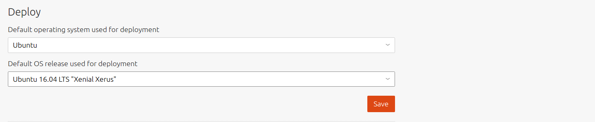
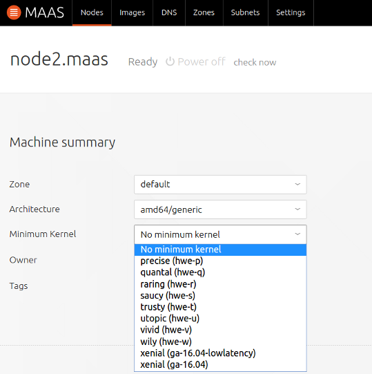
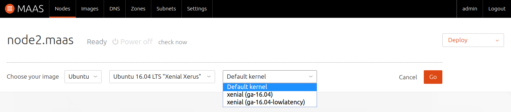

Title: Ubuntu Kernels | MAAS
TODO:  Review required. There is still confusion about selecting kernels: https://goo.gl/VTbH0X
       it also appears that some kernels are hardcoded; i can't get rid of them. all very shoddy
       the 'releases' type of v3 stream does not exist at time of writing and it may never (requires rewording if this is the case)
table_of_contents: True

# Ubuntu Kernels

MAAS supports three types of kernels for its Ubuntu nodes.

- General availability kernels
- Hardware enablement kernels
- Low latency kernels

## General availability kernels

The *general availability* (GA) kernel is based on the *generic* kernel that
originally ships with a new Ubuntu version. However, what fixes that have since
entered the package archives get applied depend on what type of *stream* was
chosen when setting up the global image source for MAAS ('daily' or
'releases'). The default is 'daily', which indicates that all such fixes will
be applied. The 'releases' stream type will also have fixes applied but on a
much less frequent basis.

MAAS denotes a GA kernel like this:

`ga-<version>` : The GA kernel has the major kernel version of the kernel which
the corresponding Ubuntu release shipped with. For example, 'ga-16.04' is based
on the 'generic' 4.4 Ubuntu kernel. As per Ubuntu policy, a GA kernel will
never have its major version upgraded (until the release itself is upgraded).

## Hardware enablement kernels

New hardware gets released all the time and if an Ubuntu host is running an
older kernel then that hardware likely won't be supported by it. Ubuntu's
response to this is to backport more recent kernels. Doing this effectively
enables more hardware. Hence, HWE is an acronym for HardWare Enablement.

Clearly, any kernel improvements and new features are also gained by installing
an HWE kernel.

!!! Note: There is the notion of an HWE *stack*. This refers to the (graphical)
X portion (in addition to the kernel) when the Ubuntu host is running a desktop
environment. This is not the case with MAAS as nodes are provisioned strictly
as non-graphical servers.

Note that these backported/HWE kernels are only available for LTS releases
(e.g. Precise, Trusty, Xenial, etc). For example, the first available HWE
kernel for Ubuntu 16.04 LTS (Xenial) will be the GA kernel from Ubuntu 16.10
(Yakkety). 

In MAAS, HWE kernels are referred to by the notation `hwe-<release letter>`.
So, to install the Yakkety HWE kernel on Xenial the `hwe-y` kernel is used.
By default, when using the web UI, MAAS imports all available HWE kernels along
with its generic boot images. So if Trusty images are imported then the
following HWE kernels are included: `hwe-u`, `hwe-v`, and `hwe-w`.

See [MAAS CLI](manage-cli-images.md#select-images) for how to target
specific HWE kernels when selecting install images.

See the
[LTS Enablement Stack](https://wiki.ubuntu.com/Kernel/LTSEnablementStack)
Ubuntu wiki for the latest information on HWE.

## Low latency kernels

The low latency kernel is based on the GA kernel, but uses a more aggressive
configuration to reduce latency. It is categorized as a
[soft real-time kernel][wikipedia-real-time-computing].

MAAS denotes a low latency kernel in a few ways:

`hwe-x-lowlatency` : the Xenial low latency HWE kernel for Trusty
`ga-16.04-lowlatency` : the low latency GA kernel for Xenial
`hwe-16.04-lowlatency` : the low latency HWE kernel for Xenial

!!! Note: As time of writing, the last 2 kernels are the same.

[wikipedia-real-time-computing]: https://en.wikipedia.org/wiki/Real-time_computing#Criteria_for_real-time_computing

## Using kernels

The kernel installed on a node during deployment is, by default, the Ubuntu
release's native kernel. However, it is possible to tell MAAS to use a
different kernel. This can be done in three ways:

- globally (default minimum kernel)
- per machine (minimum kernel)
- per machine during deployment (specific kernel)

!!! Note: MAAS will emit an error if a configured minimum kernel version (or
newer) is not available for the machine's Ubuntu release.

See [MAAS CLI](manage-cli.md#set-a-default-minimum-kernel) for how to
perform these three configurations from the CLI.

### Default minimum kernel

To set the default minimum kernel for all machines visit the 'Settings' page
and select a kernel in the 'Default Minimum Kernel Version' field. Don't
forget to click 'Save'.

### Machine minimum kernel

To set the minimum kernel on a machine basis, select a machine from the 'Nodes'
page and click the `Edit` button in the 'Machine summary' pane. Then select a
kernel in the 'Minimum Kernel' field and 'Save changes'.

### Machine kernel during deployment

To set a specific kernel during deployment, select a machine from the 'Nodes'
page and choose `Deploy` under 'Take action'. Then select a kernel in the
'Default kernel' field. Hit 'Go' to initiate the deployment.

MAAS verifies that the specified kernel is available for the given Ubuntu
release (series) before deploying the node. 
