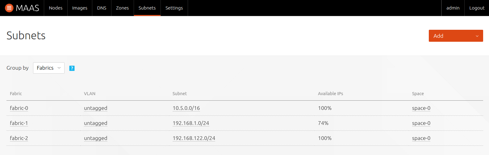
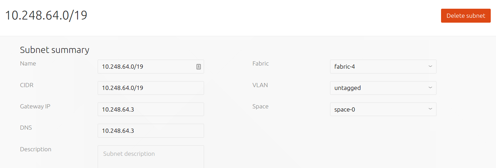
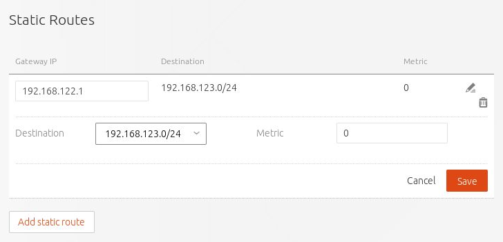
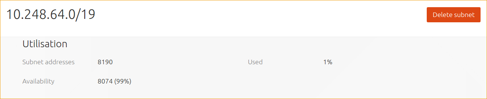
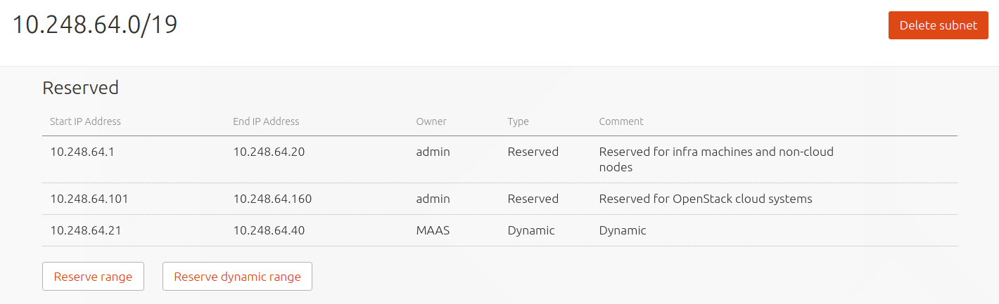
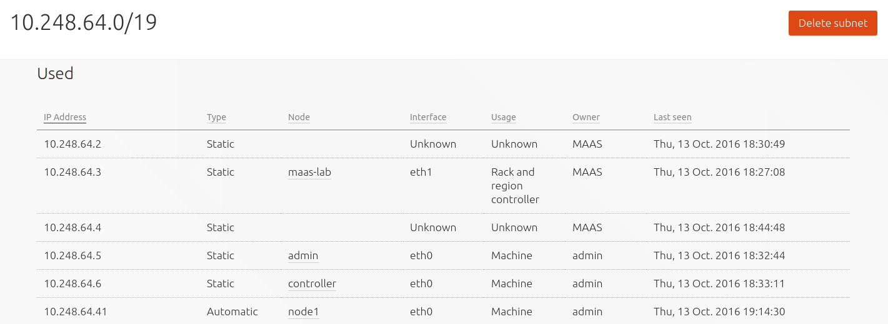

Title: Networking | MAAS
TODO:  Bug check: https://goo.gl/mPKBRl
       Not sure about the purpose of "deleting" a subnet. Won't it reappear eventually?

# Networking

This page shows where to view and edit the main networking elements in MAAS.
It also links to some important networking sub-topics. See
[Concepts and terms](intro-concepts.md) for networking element definitions.

## Main view

To access the main networking view visit the 'Networks' page:

In the above example the following networking elements can be seen: *fabrics*,
*VLANs*, *subnets*, and *spaces*. Due to the nature of the particular network
topology being represented here, some elements are used multiple times. To be
clear, in this example there are 3 fabrics, 1 VLAN, 3 subnets, and 1 space and
they should all be detected automatically by MAAS.

This main view can also be filtered either by fabrics or by spaces through the
use of the 'Group by' dropdown.

Although each of the elements can be clicked upon to open up its own window,
fabrics, VLANs, and spaces do not have much in the way of configuration; their
names and descriptions can be altered. A VLAN, however, can additionally have
its MTU changed and also has an action available for
[enabling DHCP](installconfig-subnets-dhcp.md) (see 'Take action' button).

A subnet, on the other hand, can be configured considerably and its window also
shows information pertinent to the day-to-day operation of MAAS. For these
reasons, a subnet will now be examined in more detail.

### Subnet window

Clicking a subnet (here `10.248.64.0/19`) will display its window. We'll look
at this example window by sections.

The **Subnet summary** section:

!!! Warning: The fields in this section are immediately editable and changes
are applied instantly.

Here, values for 'Gateway IP' and 'DNS' (nameserver), and optionally
'Description', should be entered. Gateway
and DNS values are passed to deployed nodes unless an external DHCP server will
be used to *deploy* nodes. There is also the option of changing the subnet's
fabric, VLAN, and space providing your network topology allows for it.

Even if an external DHCP server will be used it is highly recommended that
values for gateway and nameserver be entered in case you later remove your
external DHCP and/or choose an IP assignment mode other than 'DHCP'.

When the 'Active mapping' checkbox is enabled, MAAS will scan the subnet every
3 hours to discover hosts that have not been discovered passively. 

The **Static Routes** section:

This section can be used to define a static route between two subnets, allowing
administrators to configure reachability to a subnet from a source subnet. A
route is defined on a per-subnet basis to use a particular gateway, using a
configured destination and metric.

To create a static route, click the 'Add static route' button to reveal the
edit pane. Enter a Gateway IP address, select a destination subnet from the
'Destination' drop-down list, and edit the routing metric value if needed.
Clicking 'Add' will activate the route. Routes can be edited and removed using
the icons to the right of each entry. 

The **Utilisation** section:

'Subnet addresses' shows the total number of addresses associated
with the subnet, here 8190. 'Availability' shows how many of those addresses
are unused, and therefore "available", here 8074, which corresponds to a
percentage of roughly 99% of the total. Finally, 'Used' shows the percentage
that *is* used, here roughly 1%.

The **Reserved** section:

This shows the *reserved IP ranges*. This is an important subject and is
treated separately in [IP ranges](installconfig-subnets-ipranges.md).

The **Used** section:

This section displays hosts (not necessarily MAAS nodes) associated with the
used addresses along with related bits of host information.
