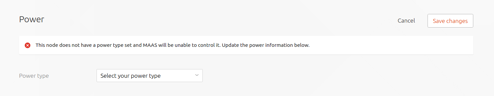
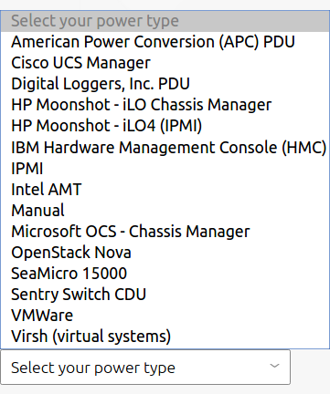
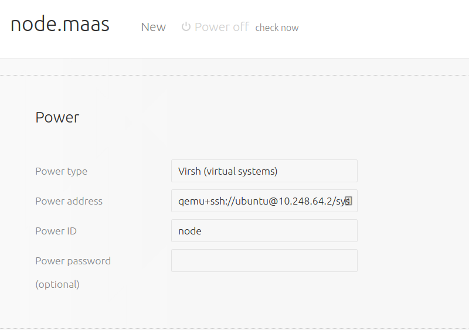

Title: BMC Power Types | MAAS
TODO:  Provide examples for setting up common power types (BMCs)

# BMC Power Types

In order for MAAS to fully manage a node it must be able to power cycle it.
This is done via a communication channel with the [BMC][bmc-wikipedia] card of
the node's underlying system. A newly added node is therefore incomplete until
its power type has been configured. Since each BMC card is different, the
required information to provide MAAS will vary.

To configure a power type, visit the 'Nodes' page, select the node in question
and scroll down to the 'Power' section. There, should see MAAS prompting you to
set up the power type:

Choosing the 'Edit' button will reveal a list of avaiable power types:

Below, the example node is backed by KVM so 'Power type' `Virsh` has been
selected. The 'Power address' of `qemu+ssh://ubuntu@10.248.64.4/system` has
been entered based on the IP address of the KVM host. Finally, and out of
necessity for virsh, the value of `Power ID` is the KVM domain (guest) name,
here `node1`.

See
[MAAS CLI](manage-cli-advanced.md#update-node-hostname-and-power-parameters)
for an example of how to edit a power type with the CLI.

## BMC driver support

MAAS supports many types of BMC hardware yet not all the drivers have the same
capabilities. See the below table for a feature comparison of the BMC drivers
currently supported by MAAS.

[bmc-wikipedia]: https://en.wikipedia.org/wiki/Intelligent_Platform_Management_Interface#Baseboard_management_controller

^# BMC driver feature table

  | Power Driver (*X=supported*) | PXE Next Boot | Power Querying | Chassis Configuration | Enhanced UI Error Reporting | BMC Enlistment |
  |:--------------------------------------|-------------|-----------|---------------|-----------------|------------|
  | American Power Conversion (APC) - PDU |             |           |               |                 |            |
  | Cisco UCS Manager                     |      X      |     X     |       X       |                 |            |
  | Digital Loggers, Inc. - PDU           |             |           |               |                 |            |
  | HP Moonshot - iLO Chassis Manager     |      X      |     X     |       X       |                 |            |
  | HP Moonshot - iLO4 (IPMI)             |      X      |     X     |               |                 |     X      |
  | IBM Hardware Management Console (HMC) |      X      |     X     |               |                 |            |
  | IPMI                                  |      X      |     X     |               |       X         |     X      |
  | Intel AMT                             |      X      |     X     |               |       X         |            |
  | Manual                                |             |           |               |                 |            |
  | Microsoft OCS - Chassis Manager       |      X      |     X     |       X       |                 |            |
  | OpenStack Nova                        |             |     X     |               |                 |            |
  | SeaMicro 15000                        |      X      |     X     |       X       |                 |            |
  | Sentry Switch CDU - PDU               |             |           |               |                 |            |
  | VMWare                                |      X      |     X     |       X       |                 |            |
  | Virsh (virtual systems)               |      X      |     X     |       X       |                 |            |
