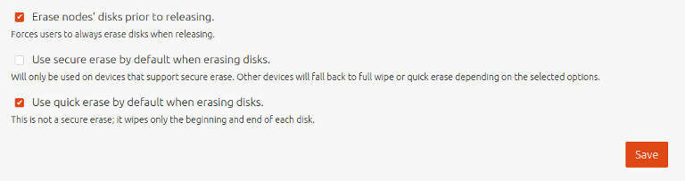
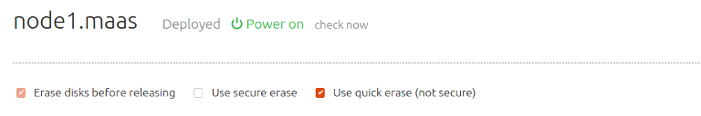

Title: Disk Erasure | MAAS

# Disk Erasure

Disk erasure pertains to the erasing of data on a node's disks when the node
has been released (the [Release](intro-concepts.md#release) action) back into
the pool of available nodes. The user can choose from among three erasure types
before confirming the Release action. A default erasure configuration can also
be set.

## Erasure types

The three types of erasure types are:

- Standard erase
- Secure erase
- Quick erase

Each of these will be explained below.

### Standard erase

### Secure erase

### Quick erase

## Default configuration

A default erasure configuration can be set on the Settings page. Scroll down
to the Storage section:

If option 'Erase nodes' disks prior to releasing' is chosen then users will be
compelled to use disk erasure. That option will be pre-filled in the node's
view and the user will be unable to remove the option.

With the above defaults, the node's view will look like this when the Release
action is chosen:

Where 'secure erase' and 'quick erase' can then be configured by the user.

## Order of preference

If all three options are left checked when the node is released the following
order of preference is applied:

1. Use 'secure erase' if the disk supports it
1. If it does not then use 'quick erase'
