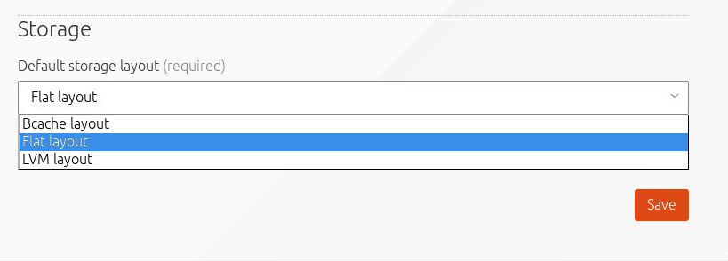

Title: Storage | MAAS
TODO:  Can a user change a node's layout only if the user has acquired that node?


# Storage

MAAS has the ability to configure the storage of a deployed node. It supports
standard partitioning as well as more complex storage options such as Bcache,
RAID, and LVM. It also offers fine-grained control over the creation, deletion,
formatting and mounting of both [block devices](installconfig-block.md) and
[partitions](installconfig-partitions.md).

## Layouts

The configuration that gets assigned to a node is known as a storage *layout*.
Specifically, a layout can be applied to a node only once it has been
commissioned.
There are three such layout types:

- LVM layout
- Flat layout
- Bcache layout

A MAAS administrator can set which layout will be the default if one is not
explicitly set for a node by the user.
they acquire a node or after they have acquired a
node with the set-storage-layout API. The user acquiring a node or performing
the set-storage-layout API calls can also customize the layout generation.
Each layout has a set of options that can be set to adjust the generated
layout.

### LVM Layout

The 'LVM Layout' creates a volume group vgroot on a partition that spans the
entire boot disk.  A logical volume lvroot is created for the full size of the
volume group. The lvroot is formatted with ext4 and set as the / mount point:


| Name      | Size     | Type  | Filesystem Type       | Mount point  |
|:----------|----------|-------|---------------|--------------|
| sda       | 100G     | disk  |               |              |
| sda1      | 512M     | part  | fat32         | /boot/efi    |
| sda2      | 99.5G    | part  | lvm-pv(vgroot)|              |
| vgroot    | 99.5G    | lvm   |               |              |
| lvroot    | 99.5G    | lvm   | ext4          |  /           |

The following options are supported for this layout. :

`boot_size`: Size of the boot partition on the boot disk. Default is 0, meaning not to
create the boot partition. The '/boot' will be placed on the root filesystem.

`root_device`: The block device to place the root partition on. Default is the boot disk.

`root_size`: Size of the root partition. Default is 100%, meaning the entire size of the
root device.

`vg_name`: Name of the created volume group. Default is `vgroot`.

`lv_name`: Name of the created logical volume. Default is `lvroot`.

`lv_size`: Size of the created logical volume. Default is 100%, meaning the entire size of
the volume group.

### Flat Layout

With a 'Flat Layout', MAAS creates a partition that spans the entire boot disk. The partition is
formatted with ext4 and set as the / mount point:

| Name      | Size     | Type  | Filesystem Type       | Mount point  |
|:----------|----------|-------|---------------|--------------|
| sda       | 100G     | disk  |               |              |
| sda1      | 512M     | part  | fat32         | /boot/efi    |
| sda2      | 99.5G    | part  | ext4          | /            |


The following options are supported for this layout. :

`boot_size`: Size of the boot partition on the boot disk. Default is 0,
	meaning not to create the boot partition. The '/boot' will be placed on
the root filesystem.
    
`root_device`: The block device to place the root partition on. Default is the
boot disk.
    
`root_size`: Size of the root partition. Default is 100%, meaning the entire
size of the root device.

### Bcache Layout

A 'Bcache Layout' will create a partition that spans the entire boot disk as
the backing device. It uses the smallest block device tagged with 'ssd' as the
cache device. The Bcache device is formatted with ext4 and set as the / mount
point.  If no block devices exists on the node that are tagged with 'ssd' then
the Bcache device will not be created and the 'Flat Layout' will be used
instead:

| Name      | Size     | Type  | Filesystem Type       | Mount point  |
|:----------|----------|-------|---------------|--------------|
| sda       | 100G     | disk  |               |              |
| sda1      | 512M     | part  | fat32         | /boot/efi    |
| sda2      | 99.5G    | part  | bc-backing    |              |
| sdb (ssd) | 50G      | disk  |               |              |
| sdb1      | 50G      | part  | bc-cache      |              |
| bcache0   | 99.5G    | disk  | ext4          | /            |

The following options are supported for this layout. :

`boot_size`: Size of the boot partition on the boot disk. Default is 0, meaning
not to create the boot partition. The '/boot' will be placed on the root
filesystem.

`root_device`: The block device to place the root partition on. Default is the
boot disk.

`root_size`: Size of the root partition. Default is 100%, meaning the entire
size of the root device.

`cache_device`: The block device to use as the cache device. Default is the
smallest block device tagged ssd.

`cache_mode`: The cache mode to set the created Bcache device to. Default is
`writethrough`.

`cache_size`: The size of the partition on the cache device. Default is 100%,
meaning the entire size of the cache device.

`cache_no_part`: Whether or not to create a partition on the cache device.
Default is false, meaning to create a partition using the given `cache_size`.
If set to true no partition will be created and the raw cache device will be
used as the cache.

!!! Note: The /boot/efi partition on all layouts will only be created on nodes
that deploy with UEFI.

## Setting the Layout

It's also possible to change the storage layout either globally, on acquire, or
after acquire.

### Globally

The global default storage layout can be set using either the API or the web
interface. From the web interface, for example, look for 'Default Storage Layout' on the
settings page:



To change the default storage layout from the command line, you would enter the
following:

```bash
maas admin maas set-config name=default_storage_layout value=flat
```
If this command is successful, you will see the following output:

```bash
Success.
Machine-readable output follows:
OK
```

For the default storage layout to apply, a node will need will need to be in
the 'Ready' state, before being acquired. 

### Per node

If a node is already acquired and you want to adjust the storage layout the
`set_storage_layout API` call can be used:

```bash
maas admin machine set-storage-layout <node-id> storage_layout=lvm lv_size=<size>
```
!!! Warning: This will completely remove any previous storage configuration on all
block devices.
