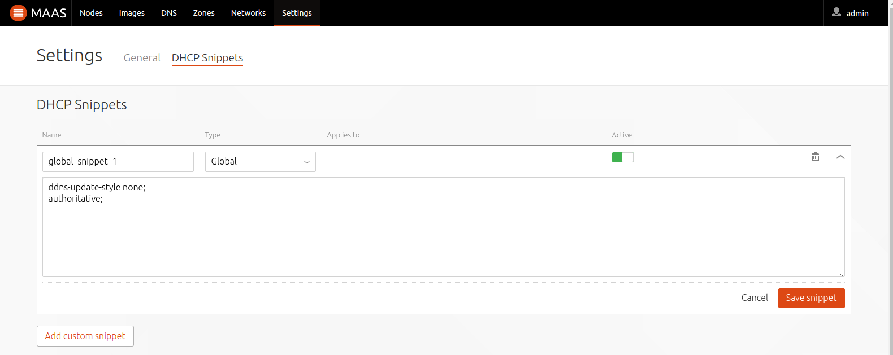

Title: DHCP

# DHCP

In order for MAAS to manage machines, and more specifically, in order to
enlist, commission and deploy machines, it needs to provide DHCP (and PXE
booting) on at least one untagged VLAN. However, an external DHCP instance can
still be used on a tagged VLAN in order to service already deployed machines. 

Normally the machine subnet is on the above VLAN, but if this is not the case
then DHCP packets will need to be specially routed between the subnet and the
MAAS-provided DHCP subnet. 

## Competing DHCP

Enabling your own DHCP server that competes with one that's being managed by
MAAS can cause serious disruption. Make sure you understand the implications of
running a DHCP server before doing this. If MAAS detects external DHCP servers
on its networks, it will show them on the rack controller page in the web UI.

## Dynamic IP ranges

A dynamic IP range is needed in order for MAAS to be able to provide DHCP for
machines. Addresses in the range get assigned to machines that are being:

- auto-registered (also called enlisted)
- commissioned

Deployed machines will obtain IP addresses from the part of the subnet that is
*not* included in the above dynamic range. Such a "deployment IP range" does
not need to be specified. These addresses will remain allocated to machines
throughout their deployment lifecycle.

## Enabling DHCP

Under the 'Networks' tab choose a VLAN and enable DHCP:

1. Under the 'Take action' button select 'Provide DHCP'. A new window will
appear.
1. Select the primary rack controller. For DHCP HA, select both the primary
and the secondary.
1. Create a dynamic IP range. Fill in the fields 'Dynamic range start IP' and
'Dynamic range end IP'.
1. Configure a default gateway. Fill in the field 'Gateway IP'.
1. Apply your changes with the 'Provide DHCP' button.

See [MAAS CLI](./manage-cli-common.html#enable-dhcp) for doing this with the CLI.

If necessary, it is possible to add further portions of the subnet to the
dynamic IP range (see
[Reserved IP addresses](./installconfig-network-static.html#reserved-ip-addresses)
). Furthermore, since DHCP is enabled on a VLAN basis and a VLAN can contain
multiple subnets, it is possible to add a portion from those subnets as well.
Just select the subnet under the 'Networks' tab and reserve a dynamic range.
DHCP will be enabled automatically.

## DHCP Snippets

When DHCP is managed from within MAAS, it can be customized through the use of
*DHCP snippets*. These are user defined configuration options that can be
applied either globally, per subnet, or per node. A global snippet is applied
to all VLANs, subnets, and nodes. All three types end up in
`/var/lib/maas/dhcpd.conf` or `/var/lib/maas/dhcpd6.conf`. For information on
what options to use refer to the
[`dhcpd.conf` man page](http://manpages.ubuntu.com/cgi-bin/search.py?q=dhcpd.conf).

!!! Note: This feature is available in MAAS versions 2.0 and above.
Modifications made directly to `dhcpd.conf.template` or `dhcpd6.conf.template` are
no longer supported.

To manage snippets, as an admin, open the 'Settings' page and click on the
'DHCP Snippets' tab.

See [MAAS CLI](./manage-cli-dhcp-snippets.html) for doing this with the CLI.
