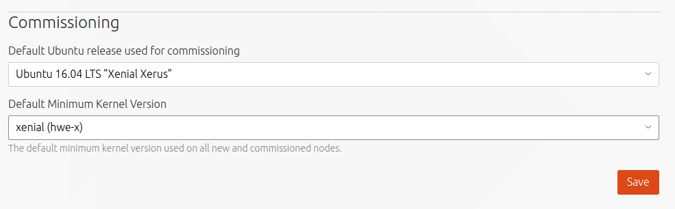
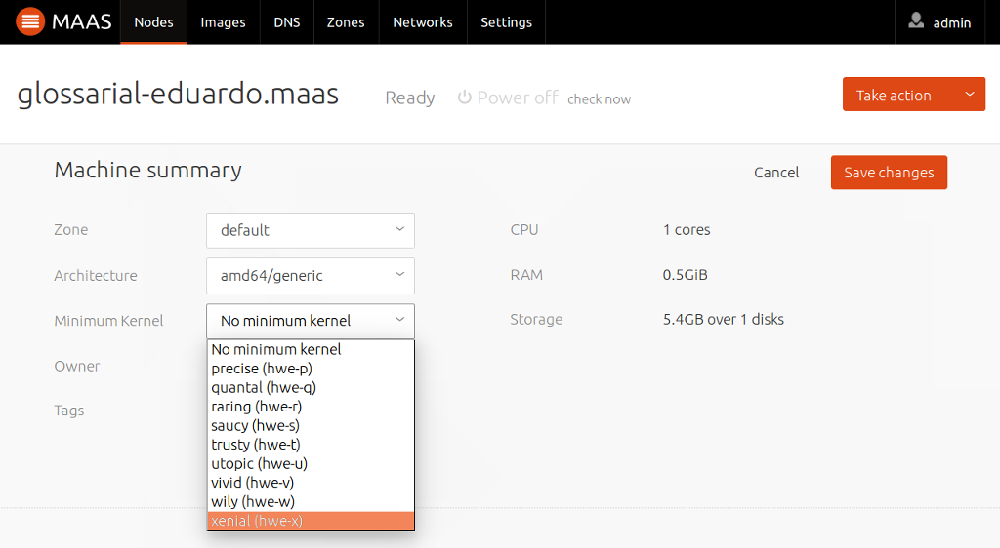
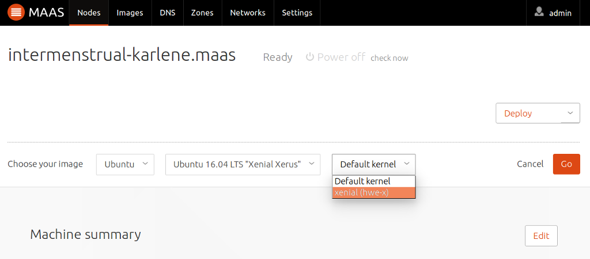

Title: HWE kernels

# HWE kernels

MAAS supports HWE kernels for its Ubuntu nodes.

## What are HWE kernels?

New hardware gets released all the time and if an Ubuntu host is running an
older kernel then that hardware likely won't be supported by it. Ubuntu's
response to this is to backport more recent kernels. Doing this effectively
enables more hardware. Hence, HWE is an acronym for HardWare Enablement.

Clearly, any kernel improvements and new features are also gained by installing
a HWE kernel.

!!! Note: There is the notion of a HWE *stack*. This refers to the (graphical)
X portion (in addition to the kernel) when the Ubuntu host is running a desktop
environment. This is not the case with MAAS as nodes are provisioned strictly
as non-graphical servers.

Note that these backported/HWE kernels are only available for LTS releases
(e.g. Precise, Trusty, Xenial, etc). For example, the first available HWE
kernel for Ubuntu 16.04 LTS (Xenial) will be the kernel from Ubuntu 16.10
(Yakkety). 

In MAAS, HWE kernels are referred to by the notation `hwe-<release letter>`.
So, to install the Yakkety HWE kernel on Xenial the `hwe-y` kernel is used.
By default, when using the web UI, MAAS imports all available HWE kernels along
with its generic boot images. So if Trusty images are imported then the
following HWE kernels are included: `hwe-u`, `hwe-v`, and `hwe-w`.

See [MAAS CLI](./manage-cli-images.html#select-images) for how to target
specific HWE kernels when selecting install images.

See the [LTS Enablement
Stack](https://wiki.ubuntu.com/Kernel/LTSEnablementStack) Ubuntu wiki for
the latest information on HWE.

## Using HWE kernels

The kernel installed on a node is, by default, the Ubuntu release's native
kernel. However, it is possible to tell MAAS to use a HWE kernel. This can be
done in three ways:

- globally (default minimum kernel)
- per machine (minimum kernel)
- per machine during deployment (specific kernel)

!!! Note: MAAS will emit an error if a configured minimum kernel version (or
newer) is not available for the machine's Ubuntu release.

See [MAAS CLI](./manage-cli.html#set-a-default-minimum-kernel) for how to
perform these three configurations from the CLI.

### Default minimum kernel

To set the default minimum HWE kernel for all machines visit the 'Settings' page
and select a HWE kernel in the 'Default Minimum Kernel Version' field. Don't
forget to click 'Save'.

### Machine minimum kernel

To set the minimum HWE kernel on a machine basis visit the machine's page and click
the `Edit` button in the 'Machine summary' pane. Then select a HWE kernel in the
'Minimum Kernel' field and 'Save changes'.

### Machine kernel during deployment

To set a specific HWE kernel during deployment visit the machine's page and choose
`Deploy` under 'Take action'. Then select a HWE kernel in the 'Default
kernel' field. Hit 'Go' to initiate the deployment.

MAAS verifies that the specified kernel is available for the given Ubuntu
release (series) before deploying the node. 
