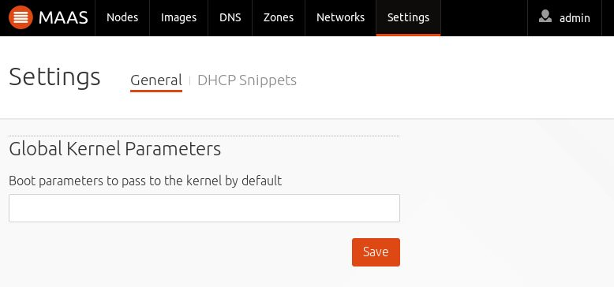

Title: Kernel Boot Options
TODO: Review
      Add rationale/examples for using non-default kernel boot options

# Kernel Boot Options

MAAS is able to send specific kernel options to booting nodes on both a global
basis and a per-node basis.

## Global kernel options

To set kernel options globally, as an admin, open the 'Settings' page and
scroll down to the `Global Kernel Parameters` section, as shown here:

Type in the desired options and click 'Save'. The contents of the field will be
used as-is. Do not use extra characters.

See [MAAS CLI](./manage-cli-advanced.html#set-the-default-kernel-boot-options)
for how to do this with the CLI.

## Per-node kernel options

Per-node kernel options are set using the CLI. See
[MAAS CLI](./manage-cli-advanced.html#specify-kernel-boot-options-for-a-machine) for
instructions.

Note that per-node kernel options take precedence to global options.
