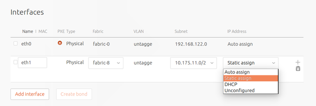
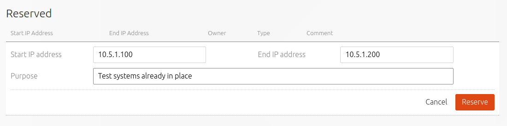

Title: Static IPs
TODO:  This page is improperly titled; reserving addresses should not be associated with static addresses

# Static IPs

Previously, MAAS relied on the DHCP server to allocate its own IP addresses to
nodes, using the IP range defined on the relevant cluster interface. This was
found to be unreliable since the IPs were only known once the node had booted
and requested an address, and had race conditions when the lease expired and
another machine was looking for its own IP.

MAAS now defines an additional range on the cluster for static IPs that are
allocated by MAAS itself (see [rack-configuration](installconfig-rack.md)
for more information about this).

In normal operation, MAAS will automatically choose and allocate a static IP
to any node network interfaces where it knows on which cluster interface that
node interface is connected. 

You can choose to change this default behaviour from within the GUI by
selecting a 'Ready' or 'Broken' node from the `Nodes` page, and scrolling down
to the `Interfaces` section. Alongside each interface, in the `IP Address`
column, you can use the drop-down menu to select between `Auto Assign`, `Static
Assign`, `DHCP` and `Unconfigured`. Selecting `Static Assign` will add a new
field beneath the menu where you can enter the IP address you'd like to
allocate to the interface. 

## Reserved IP addresses

It is possible to reserve a portion of a subnet which MAAS will not lease for
deployed nodes. This is for when you have machines on the subnet that are not
managed by MAAS (use 'reserved') or when you want MAAS to provide DHCP for
provisioning (use 'reserved-dynamic'). Note that the latter is part of the
process of [providing DHCP](installconfig-rack.md#providing-dhcp). Having
to do so manually is usually because the initial IP range can no longer satisfy
current demands.

As an admin user, open the 'Networks' page and select the appropriate subnet.
Scroll down to the 'Reserved' section and choose 'Reserved range' or 'Reserved
dynamic range' depending on whether your reserved addresses will be static or
dynamic. If the latter is chosen, MAAS will automatically provide DHCP for
enlistment and commissioning provided that the associated VLAN has DHCP
enabled.

When either of those two options are chosen a window will appear allowing you
to enter start and end addresses for the range as well as a comment.

Below is an example window when creating a 'Reserved range' (both windows are
actually identical):

Click the 'Reserve' button when done.

See [MAAS CLI](manage-cli-common.md#reserve-ip-addresses) for doing this
with the CLI.
