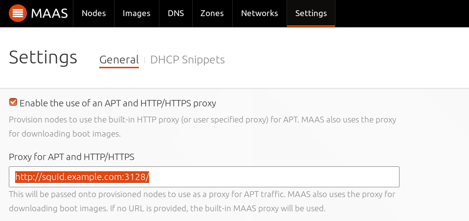

Title: MAAS Proxying

# MAAS Proxying

MAAS provides a way for its managed machines to use a proxy server when they
need to access HTTP/HTTPS-based resources, such as the Ubuntu package archive.

There are three possible options:

- internal proxy (default)
- external proxy
- no proxy

Configuring proxying with MAAS consists of enabling/disabling one of the above
three options and enabling/disabling proxying on a specific subnet.

## Internal proxy (MAAS proxy)

MAAS provides an internal proxy server. Although it is set up to work well with
APT/package requests, it is effectively a HTTP caching proxy server. If the
region controller is configured in MAAS as the default gateway for the machines
it manages then the proxy will work transparently (on TCP port 3128).
Otherwise machines will need to access it on TCP port 8000.

By default, the proxy is available to all hosts residing in any subnet detected
by MAAS, not just MAAS-managed machines. It is therefore recommended to disable
access to those subnets that represent untrusted networks.

MAAS manages its proxy. So although the active configuration, located in file
`/var/lib/maas/maas-proxy.conf`, can be inspected, it is not to be hand-edited.

The proxy must be installed on the same host as the region controller (via the
'maas-proxy' package).

## Configure proxying

See the [MAAS CLI](./manage-cli-common.html#configure-proxying) for how to
configure proxying with the CLI. Note that per-subnet proxy configuration can
only be accomplished via the CLI.

In the web UI, visit the 'Settings' page, select the 'General' tab and scroll
down to the 'Network Configuration' section. Any changes made are applied by
pressing the 'Save' button.

To enable the internal proxy, ensure that the checkbox (for 'Enable the use of
an APT and HTTP/HTTPS proxy') is checked. This is the default configuration.

To enable an external proxy, in addition to ensuring that the checkbox is
checked, define the proxy's URL (and port if necessary) in the field 'Proxy for
APT and HTTP/HTTPS'.

To disable proxying completely ensure that the checkbox is unchecked.
