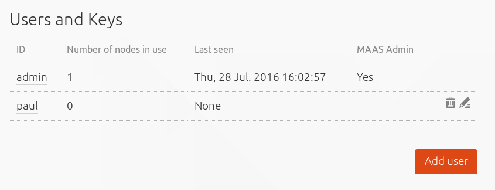
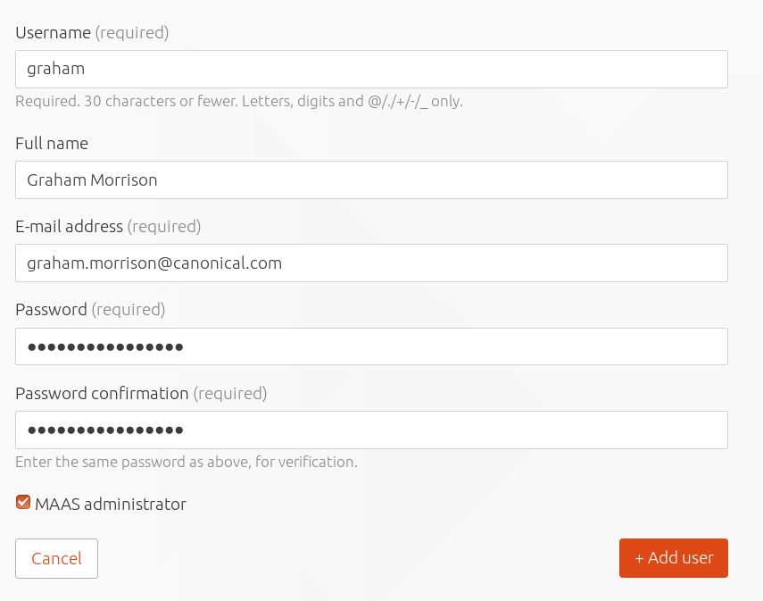
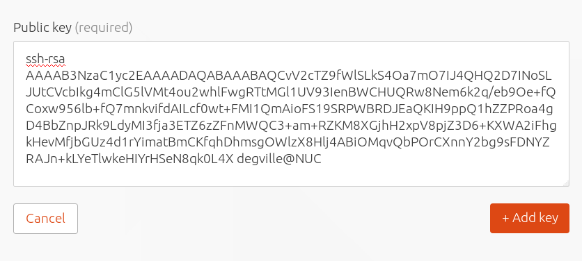
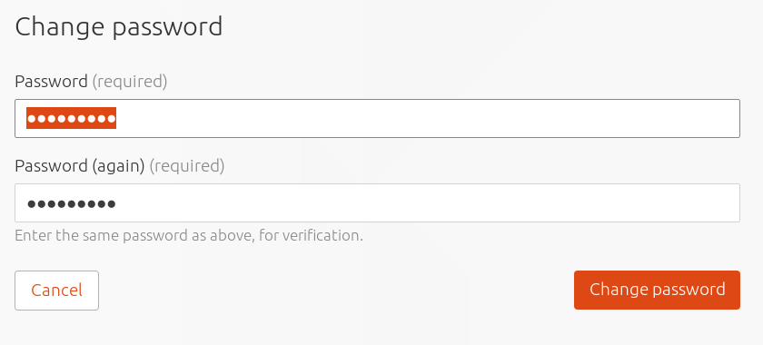

Title: User Accounts

# User Accounts

User accounts can be created, edited and deleted from the 'Users and Keys'
section at the top of the general 'Settings' page of the web UI.  Moving the
cursor over an existing account will show icons to allow either the editing or
deletion of an account.

!!! Note: you can't delete the account you're using from the web UI

## Add a user

Clicking the 'Add User' button will open a pane asking for details on the new
user, including their username, email address and password. A checkbox is used
to define whether a user is a MAAS administrator or not.

A MAAS administrator can manage all aspects of MAAS, whereas a
non-administrator user can perform a subset of tasks on machines they acquire
and deploy. A non-admin user is also limited in the details they can view, such
as nodes allocated to other users, and they have no access to the global
settings page in the web UI nor any of the equivalent API calls from the
command line.

## SSH keys

Before either an administrator or a user can deploy a machine, they need to
import their public SSH key(s) into MAAS. This can be done within the web UI by
selecting the 'Account' option from the user menu in the top right, opening the
user preferences page and clicking on the 'Add SSH key' button.

To add a key, paste the contents of the local public
SSH key file (usually `$HOME/ssh/id_rsa.pub`) into the box and select 'Add
key'. SSH keys can be viewed and removed from the 'SSH keys'
section of the user preferences page. 

## API key

The user preferences page includes an API key for the currently active user.
This can be copied and regenerated as needed. The API key is currently used to
login to the API from the [command line](manage-cli.html), and by Canonical's
application and service modelling tool,
[Juju](https://jujucharms.com/docs/stable/clouds-maas). 

## Change the password

The password for the current user can be easily changed from the bottom of the user
preferences page by entering the old password, entering a new password and a
confirming the new password. 

An administrator can also change a user's password by selecting 'edit' against a user
account in the 'Users and Keys' section of the general settings page and
providing a new password.

